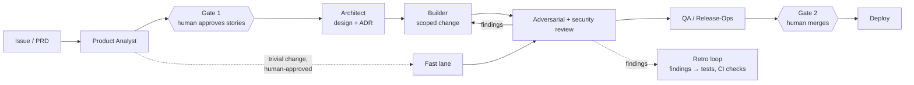

# ADLC Pipeline — a portable Agentic SDLC plugin

Export the four-agent software-delivery pipeline (Product Analyst → Architect → Builder →
QA/Release-Ops, with two human gates) to **any** repository — whether it's greenfield (only
a PRD) or a mature codebase — and be running in minutes.


## At a glance



- **Two human gates, never skipped.** Agents move work *up to* a gate, never through it. No agent verifies, merges, or deploys its own work.
- **Deterministic where it matters.** Path scope, direct-push detection, fix-loop caps and verdict parsing are small unit-tested shell scripts shared by CI and a local pre-commit hook.
- **Gets better every run.** Review findings are logged as structured data and turned into regression tests and CI checks, not longer prompts.
- **Cost is measured, not guessed.** Per-lane latency from Actions run data; per-agent tokens, cost and prompt-cache hit rate via opt-in OpenTelemetry.
- **Works on any repo.** A bootstrap wizard adapts the pipeline to a greenfield PRD or a mature codebase in minutes.

## What's inside

<details>
<summary>Repository layout</summary>

```
.claude-plugin/plugin.json     # manifest (plugin name: "adlc")
agents/                        # the 4 role agents + adversarial-reviewer (stack-agnostic)
skills/
  charter/                     # portable process rules: principles, roles, state machine, gates
  triage/                      # size an issue → fast lane (trivial) vs full pipeline
  edd-spec/                    # story/AC templates, traceability, metric taxonomy
  security-gate/               # secure-coding checklist + severity rubric (two modes)
  code-review/                 # scoped adversarial review: break assumptions, enforce contracts, no echo chamber
  test-strategy/               # scan repo + PRD → propose the CI test battery (not the test bodies)
  retro/                       # self-improvement loop: recurring findings → durable guards (propose-only)
  verify/                      # what proves a stage is done — per-role exit criteria
  efficient-runs/              # keep long runs cheap (cost ∝ #steps); shared by Builder/QA
  ablation/                    # periodic context reset so the setup doesn't rot append-only
  bootstrap/                   # ← the dual-mode adoption WIZARD
commands/adlc-init.md          # friendly alias that launches the wizard
commands/adlc-mission-control.md   # opens Mission Control, the live view of the line
mission-control/               # ← MISSION CONTROL: local live view (Python stdlib server + static page)
bin/adlc-mission-control       # its launcher (on the Bash PATH when the plugin is enabled)
hooks/hooks.json               # reports pipeline-agent activity to Mission Control when it is running
templates/                     # what the wizard fills into the host repo
  host-CLAUDE.md.tmpl          # minimalist CLAUDE.md (commands + gotchas + pointers)
  skills/project-conventions.SKILL.md.tmpl   # lean: only what the code doesn't reveal
  skills/release-ops.SKILL.md.tmpl
  charter.md.tmpl · RUNBOOK.md.tmpl · adr-template.md · CONTEXT-LOG.md.tmpl
  settings.deny.json           # harness deny rules (no push-to-main / no self-merge)
  settings.telemetry.json      # opt-in OTel env for per-agent token/cost/latency
  settings.mission-control.json   # opt-in OTel env that sends the same data straight to Mission Control
  github/labels.sh · adlc-builder.yml · adlc-qa.yml · adlc-review.yml · adlc-fix.yml
  github/adlc-intake.yml · adlc-design.yml        # auto-start (autopilot) lanes
  github/adlc-fast.yml                            # ← fast lane for trivial changes
  github/adlc-ci.yml · adlc-diff-scope.yml · adlc-main-tripwire.yml · adlc-retro.yml
  github/ISSUE_TEMPLATE/requirement.yml           # file a requirement → pipeline starts
  scripts/  adlc-diff-scope.sh · adlc-tripwire-check.sh · adlc-fix-cap.sh · adlc-verdict.sh
            adlc-log-findings.sh · adlc-doctor.sh · adlc-metrics.sh · adlc-cost.sh
            adlc-cache.sh · adlc-triage.sh · adlc-pr-stage.sh · adlc-branch-issue.sh   # deterministic logic
            #   adlc-cache.sh        = prompt-cache hit-rate rollup
            #   adlc-triage.sh       = fast-lane eligibility cap (size + sensitive-path)
            #   adlc-pr-stage.sh     = which diff-scope stage a PR is in (from its linked issue)
            #   adlc-branch-issue.sh = which issue a lane branch names (feat/<issue>-<slug>)
  hooks/pre-commit             # local diff-scope guard (reuses adlc-diff-scope.sh)
tests/run.sh                   # unit tests for the guardrail scripts (bash, no deps)
telemetry/                     # ready-to-run local OTel collector (docker compose) for token/cost
```

</details>

## Design philosophy

Built to the context-engineering rules for the Claude 5 generation: **every line of
persistent context is a tax**, so the plugin generates the *minimum* per project and makes
**verification the keystone**, not instructions. Concretely — the generated
`project-conventions` holds only what the code can't reveal (commands, roles/tenancy, seams,
gotchas); agents state an outcome + guardrails + a runnable **exit criterion** (`verify`
skill) rather than enumerating steps; hard prohibitions are reserved for genuinely dangerous
areas (merge/deploy/push/cross-gate) and otherwise enforced structurally by `tools:` grants
and deny rules; and the `ablation` skill + `CONTEXT-LOG.md` exist so the setup gets pruned,
not just appended to.

**Deterministic where it matters.** The *mechanical* guardrails — path scope, direct-push
detection, the fix-loop cap, the verdict parse, setup validation — are small shell scripts in
`scripts/`, **unit-tested** (`tests/run.sh`), and called by both CI and a **local pre-commit
hook**, so your machine and Actions run the same code. The Builder declares each change's scope
in `.adlc/scope/<issue>.txt`; the diff-scope check fails a lane PR that strays outside it or
declares none. `adlc-doctor.sh` validates a host repo's setup (deny rules, unfilled
placeholders, skills, labels). Judgment guardrails
(design conformance, security severity) stay as skills + the adversarial review — those can't
be made deterministic without losing the point.

## Self-improvement loop

The pipeline compounds knowledge every run. Every reviewer/QA/security finding is emitted as a
machine-readable `ADLC-FINDING: <severity> | <class> | <file>` line **in the PR comment** — the
durable, per-repo store (a read-only reviewer can write a comment; a CI file-commit would trip
the tripwire). The **`retro`** skill (manual `/adlc:retro` or the scheduled `adlc-retro.yml`)
**materializes** `.adlc/metrics/findings.jsonl` from those comments via `adlc-log-findings.sh`,
ranks recurring classes, and opens a **propose-only** PR that turns each into the cheapest
*durable* guard — **a regression test first, then a CI check, then a convention, and only last a
prose gotcha** — while pruning context lines that never prevented a failure (`ablation`).
Knowledge accumulates in versioned tests/checks/conventions, not model memory, so each run
starts from a higher floor without the context bloating.

**Cross-project learning.** The loop compounds *inside each repo* by default. When a lesson is
general (a new attack class, a better default, a guardrail gap), the retro tags it `scope: plugin`
and files an evidence-backed issue (`adlc:plugin-suggestion`) into the shared plugin repo
(`ADLC_PLUGIN_REPO`, default `juanjtov/adlc-pipeline`) — so improvements found in one of your
projects can be curated into the plugin and reach them all. Only from repos you own/share.

**Cost / latency / tokens.** Latency per lane and per pipeline run is tracked deterministically
by `adlc-cost.sh` (from GitHub Actions run durations — no extra infra). Token count and cost per
agent come from **opt-in OpenTelemetry** (`settings.telemetry.json`): Claude Code exports
per-session tokens + cost + duration to your OTel collector, and `service.name` groups a whole
pipeline run. A ready-to-run collector ships in `telemetry/` (`docker compose up -d`); latency
works without one.

**Mission Control.** `/adlc-mission-control` opens a live page of the line on your own machine:
one station per agent, each request moving between them, what every agent is doing right now, and
its tokens, cost and latency. It is read-only (it never labels, comments or merges), needs no
install beyond Python 3, and keeps everything local: GitHub is read through your `gh` login, agent
steps arrive through the plugin's hooks, and tokens/cost arrive as telemetry sent straight to it
(`settings.mission-control.json`, no collector). It sees agents that run **on this machine**; runs
on GitHub's runners show their GitHub state only. Details and limits: `mission-control/README.md`.
Try it with made-up data: `adlc-mission-control --demo --open`.

**Prompt caching, kept honest.** The harness re-serves each run's stable prefix — the tool set,
the loaded skills, and `CLAUDE.md` — from cache at ~0.1× input price, so cost really scales with
how well that prefix stays frozen (the `efficient-runs` skill states the rule). Two deterministic
guards keep the discount: `adlc-doctor.sh` fails a setup that leaves the unambiguous per-run
smells (an unfilled placeholder, a live CI run-id expansion) in a context file, and `adlc-cache.sh`
rolls up the `cacheRead` share per agent from the same telemetry — a lane reading 0 from cache
flags a silent invalidator. Caching regressions are silent (requests still succeed, the bill just
rises), so the metric is the point.

### Two layers, on purpose

- **Portable core** (ships in the plugin, never changes per project): the role agents, the
  `charter`/`edd-spec`/`security-gate` skills, the deny rules, the Action Card format.
- **Project substrate** (the wizard generates it per repo): `project-conventions` and
  `release-ops` skills, the per-project charter, RUNBOOK, and ADRs — the only place your
  stack, commands, deploy topology, roles, and tenancy live.

## Install

```bash
claude --plugin-dir /path/to/adlc-pipeline
```

(Or publish this repo as a plugin marketplace and `claude plugin` add it.) During
development, `/reload-plugins` picks up edits.

## Use

In the target repository:

```
/adlc-init
```

(or `/adlc:bootstrap`). The wizard will:

1. **Detect** greenfield vs brownfield — for a brownfield repo it reverse-engineers your
   conventions from the code first.
2. **Ask** a short, pre-filled questionnaire: stack, the exact test/build/run commands,
   deploy target, roles & tenancy, and whether you want the **local recipe** (recommended
   start) or **full GitHub Actions** automation.
3. **Generate** the project skills + `.claude/settings.json` deny rules + charter + RUNBOOK
   + first ADR. Nothing is committed — you review and commit.
4. **Wire GitHub** (with your OK): create the label state machine, and in full-automation
   mode drop the Actions lanes and print the one-time infra checklist.
5. **First run**: offer to turn your PRD into the first `stage:intake` issue (greenfield) or
   pick a small starter item (brownfield), then hand it to the Product Analyst.

## The pipeline

```
full:  stage:intake → gate:stories → stage:design → stage:build → stage:qa → gate:deploy
         Analyst         Gate 1        Architect      Builder       QA/Ops      Gate 2 → deploy
fast:  stage:intake → (triage) → stage:fast ─────────────────────────────→ gate:deploy
         Analyst sizes it       Builder + adversarial/security review         Gate 2 → deploy
```

Core rules (full text in the `charter` skill): author/verifier separation (no agent
verifies/merges/deploys its own work), propose-before-write for every irreversible action,
deterministic permissions (agent `tools:` + deny rules + diff-scope CI), and agents move
work *up to* a gate but never *through* it. GitHub issues are the execution source of truth.

### Fast lane (trivial changes)

Not every change earns the full four-agent path. On intake the Analyst **triages** (the `triage`
skill): a small, local, non-sensitive change — a copy fix, a config tweak, an obvious one-file
bug — is recommended for `stage:fast`, which **skips the Architect/ADR and Gate 1** and goes
straight to a scoped build + a single adversarial/security review, then the human merge gate.
Everything that makes a change safe is kept:

- **The lane is always human-approved** — the Analyst *recommends* a lane; it never routes itself,
  and **the fast lane never auto-starts**. A human applies `stage:fast` to approve it (or
  `stage:design` for the full pipeline). Even under `adlc:autopilot` the fast lane waits for that
  approval — autopilot auto-approves Gate 1 into the *full* pipeline only.
- **Author/verifier separation** — an independent adversarial + security review still runs.
- **A deterministic cap** — `adlc-triage.sh` re-checks the *real* diff (≤ 5 files / ≤ 40 lines by
  default, and nothing touching migrations, auth, infra, CI, deps, or secrets). Over-cap or
  sensitive ⇒ the change is **bounced back to the full pipeline** (`stage:design`). So a
  mis-triage — or a crafted issue arguing it's "trivial" — can't smuggle a big change through.
- **Gate 2 (human merge)** — never skipped, on any lane.

So an issue reaches `stage:fast` only when a human applies the label — either as their own triage
on a fresh issue, or to approve the Analyst's `FAST` recommendation at `gate:stories`.

## Automation modes

The wizard offers three levels, and **GitHub Actions auto-triggering needs no GitHub Pro** —
Pro was only ever about server-side branch protection on private repos:

1. **Local recipe** — the Principal drives each lane by hand per the RUNBOOK. No Actions, any
   plan. The recommended way to prove the pipeline first.
2. **Full automation · public repo** — label transitions auto-trigger the lanes; the merge
   gate is real branch protection (free on public repos); unlimited Actions minutes.
3. **Full automation · private repo (Free plan)** — lanes still auto-trigger (~2,000 Actions
   min/month free). Branch protection isn't available, so the merge gate is the `settings.json`
   deny rules + `adlc-main-tripwire.yml` (fails + files a bug on any direct push to main) +
   human Gate 2.

Full automation (either kind) needs two repo secrets: `CLAUDE_CODE_OAUTH_TOKEN`
(`claude setup-token` — subscription, no API key) and `ADLC_DISPATCH_TOKEN` (a PAT or, better,
a GitHub App token). The dispatch token is required because a workflow's default `GITHUB_TOKEN`
can't trigger another workflow — without it a lane's handoff wouldn't fire the next lane — and
it makes the Builder's PRs authored by the bot, keeping author/verifier separation real.

**Auto-start (optional, on top of full automation).** Add `adlc-intake.yml` + `adlc-design.yml`
+ the `Requirement (ADLC autopilot)` issue template, and **filing a requirement starts the
pipeline immediately** — the Analyst runs on file, the Architect runs once you approve Gate 1,
and it flows through build + review. It still stops at the two human gates (`gate:stories`,
`gate:deploy`), and only allowlisted authors can auto-trigger. Without this, stages are started
by applying `stage:*` labels by hand.

The Analyst starts when an issue **enters** auto-start intake — it comes to carry both `adlc:auto`
and `stage:intake` (the template applies both) — and at no other time: the label moves the lanes
make as the issue advances never re-run it. If it stops to ask clarifying questions, the issue
waits at `stage:intake` and the workflow takes `adlc:auto` off; answer on the issue, then **add
`adlc:auto` back** to run it again — a comment alone does not restart it. Moving an issue back
to `stage:intake` (returning the stories at Gate 1) re-runs it too.

**Full autopilot** goes one further: the `adlc:autopilot` label **auto-approves Gate 1**, so
the pipeline runs the whole chain — intake → design → build → adversarial + architect review →
QA — to a QA-approved PR, and your **only** step is reviewing and merging it at **Gate 2**.
Merge and deploy are never automated. `adlc-review.yml` runs both reviews (adversarial +
architect conformance) and carries build → qa **from the agents' verdicts, not GitHub's review
decision** — so you can enable branch protection's "require a human approval" and it gates only
the final merge. If a review flags something, **`adlc-fix.yml`** sends the PR back to the Builder
to fix and re-review automatically — capped at 3 rounds, then it tags `needs:human` — so what
reaches you is a clean PR to read and merge. Autopilot auto-approves Gate 1 into the **full**
pipeline only; it never starts the **fast lane** (that skips design, so the lane choice stays an
explicit human approval — a `FAST` recommendation waits at `gate:stories`). The label has to be
on the issue before the Analyst starts (apply it when you file); added later, it does not advance
an issue already waiting at Gate 1, and taking it off before the Analyst finishes opts back out.
