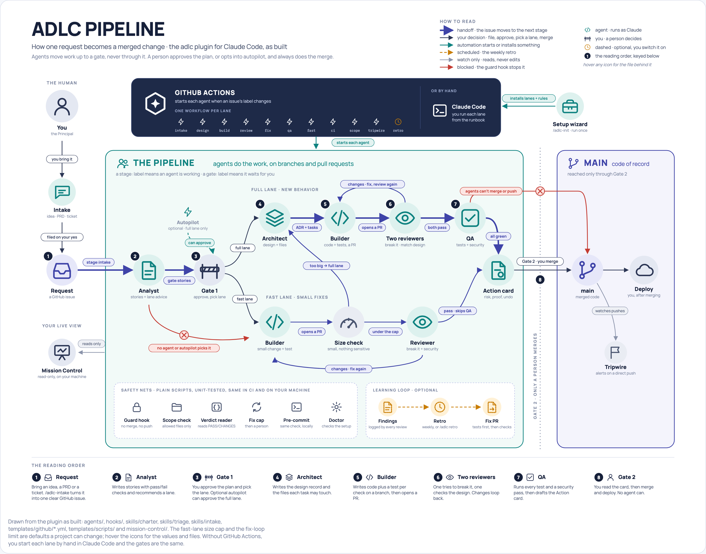

# ADLC Pipeline, Explained

Last updated: 2026-10-06

## What it is

ADLC is a Claude Code plugin that gives any code project a small team of AI agents that turn a written request into a tested, reviewed pull request. A person still makes the two decisions that matter: what gets built, and what gets merged.

Think of it as an assembly line for code changes. Each station is an AI agent with one job, and no agent ever checks its own work.

- **What goes in:** an idea, a document or a ticket, turned into one clear GitHub issue, such as "add a password reset link".
- **What comes out:** a pull request (a proposed code change) that one agent built, a separate agent reviewed and QA checked, ready for a human to merge.
- **Where it works:** a brand-new project that only has a requirements document, or an existing codebase. A setup wizard adapts it to either.
- **What it never does:** merge, deploy or push to the main branch on its own.
- **How you watch it:** Mission Control, a live page on your own machine.

The name stands for Agentic Software Development Life Cycle: the usual plan, design, build, test and release steps, run by agents.

## At a glance

Every request passes two gates. At Gate 1 you approve the plan and pick the lane; optional autopilot can approve it for you, but only into the full lane. At Gate 2 you always merge yourself. In either lane, a failed review sends the change back to the Builder, up to 3 rounds. The numbers give the reading order; [adlc-pipeline-diagram.html](adlc-pipeline-diagram.html) is the same picture with hover details for every icon.

## The team

Five AI agents do the work, and one person, called the Principal, owns the decisions. Each agent gets only the tools its job needs: its file names them, and each automated lane grants a fixed list. A guard built into the plugin also checks every shell command, and a scope check holds each pull request to its allowed files.

| Who | Their one job | What they may change | What they never do |
| --- | --- | --- | --- |
| **Product Analyst** | Turns a request into user stories with testable acceptance criteria, and recommends a lane (fast or full) | GitHub issue comments and labels only | Write code, or pick the lane itself |
| **Architect** | Writes the design decision (an ADR) and splits the work into tasks, each listing the exact files allowed. Later checks the pull request matches that design | Files under `docs/` only | Touch application code, or merge |
| **Builder** | Writes the code, plus a test for every acceptance criterion, and opens a pull request | Code, on its own feature branch | Merge, deploy, or push to main |
| **Adversarial Reviewer** | Sees only the change and tries to break it: edge cases, security holes, functions that don't exist | Nothing; it can only comment | Edit code, change labels, or merge |
| **QA & Release-Ops** | Runs the full test suite, fills test gaps, and drafts the merge-and-deploy proposal | Test folders only | Merge, deploy, or run a database migration |
| **The Principal (you)** | Approves the plan at Gate 1 and merges at Gate 2 | Everything | Nothing is done in your name without your OK |

The rule that ties the team together: whoever builds something never verifies, merges or deploys it.

## Step by step

A request goes through eight steps, and you act in only two of them. GitHub labels track where it is: a `stage:` label means an agent is working, a `gate:` label means it is waiting for you.

1. **You start a request.** Run `/adlc-intake` with an idea, a document or a ticket, or open a GitHub issue yourself. Either way it becomes one issue with the `stage:intake` label.
2. **The Product Analyst writes the stories.** If the request is unclear, it asks numbered questions on the issue and stops. Otherwise it writes user stories with pass/fail acceptance criteria and recommends a lane, then moves the issue to `gate:stories`.
3. **Gate 1: you approve the plan.** You read the stories and pick the lane: `stage:design` for the full pipeline, or `stage:fast` for the fast lane. With autopilot on, a full-lane plan is approved for you; the fast lane always waits for you.
4. **The Architect designs it.** It writes an ADR and a task list in which every task names the exact files that may change. In the automated lane the design is saved on its own branch, `adlc/design-<issue>`, and the Builder starts from there, so the ADR travels in the same pull request. The issue then moves to `stage:build`.
5. **The Builder writes the code.** On its own branch it implements the tasks and lists the files it may touch in a scope file, `.adlc/scope/<issue>.txt`. It adds a test for each acceptance criterion, runs the tests and opens a pull request.
6. **Two independent reviews.** The Adversarial Reviewer tries to break the change, and the Architect checks it matches the design. If either finds a real problem, the Builder fixes it and both run again, up to 3 rounds before a human is called in.
7. **QA proves it works.** It runs the full test suite, fills missing tests and does a security pass. If all is clean, it moves the issue to `gate:deploy` and posts a Proposed Action Card: the action, its risk, the evidence and how to undo it.
8. **Gate 2: you merge.** You read the card and the pull request, then merge and deploy yourself. No agent can do this step.

Running underneath every step:

- **A guard on every command.** The plugin checks each shell command an agent types and blocks merges, pushes to the main branch, force-pushes and direct writes to GitHub's API, in every permission mode. It also applies to your own Claude Code sessions in that repo. It reads the command's text, so treat it as a strong guardrail, not a lock; the deny rules the wizard writes stay as a second layer.
- **Branch protection is the lock.** GitHub's own rule on the main branch, that a pull request needs an approving review, is the part that cannot be talked around: the pipeline's bot cannot approve its own pull request. The setup check, `adlc-doctor.sh`, tells you whether your repo has it.
- **A scope check** fails a pull request that touches files outside its scope file, and stops such a commit on your machine. It runs from the main branch's copy, so a pull request cannot edit the check that judges it.
- **A main-branch tripwire** files an alert if anyone pushes straight to main without a reviewed pull request.
- **A weekly retro** reads past review findings and proposes regression tests and checks for repeat mistakes, as a normal pull request you approve.

## Two lanes

Small, low-risk changes can skip the design steps, but only with your approval and only if the real change stays small. The Analyst recommends a lane for every request; it never chooses one.

| Step | Full lane | Fast lane |
| --- | --- | --- |
| What the Analyst writes | User stories with acceptance criteria | A short change brief with one acceptance check |
| Your first decision | Approve the stories (Gate 1) | Approve the fast lane |
| Architect design (ADR and tasks) | Yes | Skipped |
| Builder writes code and tests | Yes | Yes |
| Adversarial and security review | Yes | Yes |
| Architect design review | Yes | Skipped, as there is no design to match |
| QA agent | Yes | Skipped; CI tests still run |
| Automatic size check | Not needed | Yes, on the real change |
| Gate 2: you merge | Yes | Yes |

A change qualifies when it touches one small area and its design is obvious: a text fix, a config value, a log line, a small bug with a clear cause. The size check holds it to 5 files and 40 changed lines by default. It must not touch database migrations, login or access-control code, infrastructure, CI, dependency files or secrets. If the real change breaks any of these limits, it goes back to the full lane automatically. Like the scope check, the size check also runs from the main branch's copy.

Two rules keep the shortcut honest:

- **The fast lane never starts on its own.** A person must apply `stage:fast`, even when autopilot is on. Autopilot can only approve Gate 1 into the full lane.
- **Gate 2 is never skipped.** Every change, in every lane, waits for a human to merge it.

## Using it

Setup is one install and one wizard, and the wizard only writes files for you to review; it never commits or pushes.

1. **Install the plugin** in Claude Code: run `/plugin marketplace add juanjtov/adlc-pipeline`, then `/plugin install adlc@adlc-pipeline`.
2. **Run the wizard** inside the project you want to use it on: type `/adlc-init`.
3. **Answer a short questionnaire.** It asks for your stack, your exact test and build commands, where you deploy and your user roles. On an existing codebase it reads the code first and pre-fills the answers.
4. **Review what it wrote.** You get the project's conventions, safety rules, charter, runbook and first ADR. Nothing is saved to git until you commit it.
5. **Start your first request.** It offers to file it through the intake interview: the first slice of your requirements document, or a small starter task in an existing project.

You also choose how much runs on its own:

| Mode | How each step starts | Your part |
| --- | --- | --- |
| Local recipe (start here) | You run each agent by hand, following the runbook | Each step, plus both gates |
| Full automation | Moving a label starts the next agent in GitHub Actions | The first label, Gate 1 and Gate 2 |
| Auto-start | Filing a requirement starts the Analyst right away | Gate 1 and Gate 2 |
| Full autopilot | Gate 1 is approved for you, full lane only | Gate 2: review and merge |

In the automated modes each step installs the plugin on GitHub's runner and runs as its named agent with a fixed list of tools. The agents, their skills and the guard come from that install; they are not copied into your repo.

Any automated mode needs two GitHub secrets: `CLAUDE_CODE_OAUTH_TOKEN`, made with `claude setup-token` from your Claude subscription, and `ADLC_DISPATCH_TOKEN`, which lets one workflow start the next. It does not need GitHub Pro. Later, `/adlc:retro` runs the improvement review on demand.

## Ways to start a request

Every request becomes one GitHub issue labeled `stage:intake`, and `/adlc-intake` gets you there from any starting point. It asks only for what is missing, shows you the exact issue, and files it after you say yes.

| You have | What happens |
| --- | --- |
| A rough idea | Claude interviews you about the problem, the outcome, the users and what is out of scope, then drafts the issue |
| A one-page brief (PRD-lite) | Claude reads it and asks only about the gaps |
| A full requirements document (PRD) | Claude proposes slices that can ship on their own and files the first one |
| An existing GitHub issue | Claude checks it is not already in the pipeline, then sharpens it in place and labels it |
| A ticket in Notion, Linear or another tracker | Claude fetches it through that tool's connector and files a GitHub issue that links back |
| A bug | Same interview, covering what happened, what you expected and how to reproduce it |
| The Analyst's open questions | Claude answers them with you, updates the issue and tells you how to restart the Analyst |
| A request that is already clear | Skip the interview: file the Requirement form on GitHub, or label your own issue `stage:intake` |

- **Connectors:** fetching from Notion or Linear needs that connector switched on in Claude Code. Without it, you paste the ticket text.
- **Safety:** text from documents and tickets is treated as information, never as instructions.
- **Division of work:** the Analyst still writes the stories and acceptance criteria. Intake only makes sure the request is clear enough to start.
- **Restarting the Analyst:** when it stops to ask questions in auto-start mode, answer on the issue and add the `adlc:auto` label back. A comment or an edit alone does not restart it.

## Watching it run

Mission Control is a live page of the line on your own machine: one station per agent, the two gates, and each request moving between them. Open it with `/adlc-mission-control`, or try it with made-up data by running `adlc-mission-control --demo --open`.

- **It only reads.** It never changes a label, posts a comment or merges.
- **It stays local.** GitHub is read through your own `gh` login, and what it records is kept in one file on your machine.
- **It sees agents on this machine.** Runs on GitHub's runners show their GitHub state (labels, pull request, verdicts), not their steps or tokens.
- **Token and cost figures are opt-in.** They appear in new sessions once you add the settings in `templates/settings.mission-control.json`; the command offers to do it.

It needs Python 3.9 or newer, and `gh` signed in. There is nothing else to install.

## Glossary

| Term | In plain words |
| --- | --- |
| Acceptance criterion (AC) | A pass/fail test of whether a story is done, written as Given / When / Then |
| ADR | Architecture Decision Record: a short file explaining a design choice, the options rejected and the trade-offs |
| Adversarial review | A review by an agent that sees only the change and assumes it is wrong until shown otherwise |
| Agent | An AI worker with one role, its own instructions and a fixed set of allowed tools |
| Author/verifier separation | The rule that whoever builds something never checks, merges or deploys it |
| Autopilot | An optional label that approves Gate 1 for you, in the full lane only |
| Branch protection | GitHub's own rule that a pull request into the main branch needs an approving review |
| CI | Continuous integration: tests that run automatically on every pull request |
| Diff scope | The list of files a change is allowed to touch |
| Fix loop | The Builder fixes review findings and the reviewers check again, up to 3 rounds |
| Gate | A checkpoint for a person. Gate 1 approves the plan; Gate 2 approves the merge |
| GitHub Actions | GitHub's built-in automation, used here to run the agents |
| Greenfield / brownfield | A brand-new project / an existing codebase |
| Guard hook | A check the plugin runs on every shell command an agent types; it blocks merges, pushes to main and force-pushes |
| Intake | Turning an idea, a document or a ticket into one clear GitHub issue the pipeline can start from |
| Issue | A GitHub ticket for one request, and the single record of where that work stands |
| Label | A tag on an issue: `stage:` means an agent is working, `gate:` means it waits for you |
| Migration | A change to the structure of a database |
| Mission Control | A read-only live page on your own machine that shows where each request is and what each agent is doing |
| PRD | Product requirements document: a written description of what to build and why |
| Principal | The person who owns the project and makes the gate decisions |
| Proposed Action Card | QA's short note before a merge: the action, its risk, the evidence and how to undo it |
| Pull request (PR) | A proposed code change, waiting for review and merge |
| Retro | A scheduled look at past review findings that proposes tests and checks so mistakes don't repeat |
| Scope file | Where the Builder lists the files a change may touch (`.adlc/scope/<issue>.txt`); the scope check holds the pull request to it |
| Triage | Sizing a request to recommend the fast lane or the full lane |
| Tripwire | A check that raises an alert when someone pushes straight to the main branch |
| User story | A short description of what a user needs and why |
